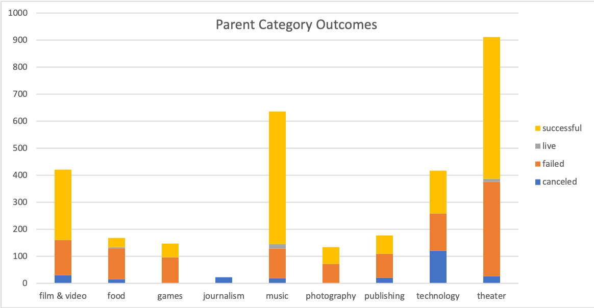
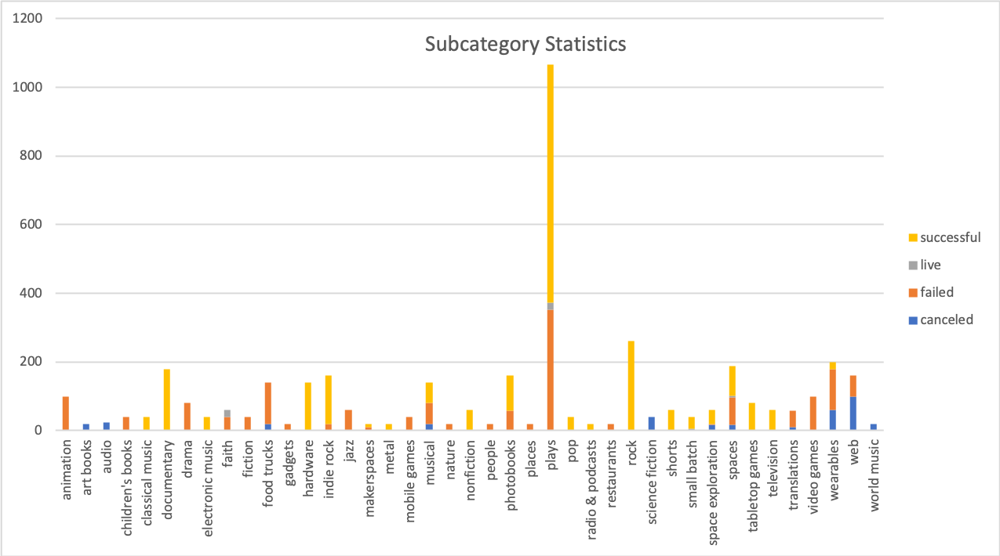
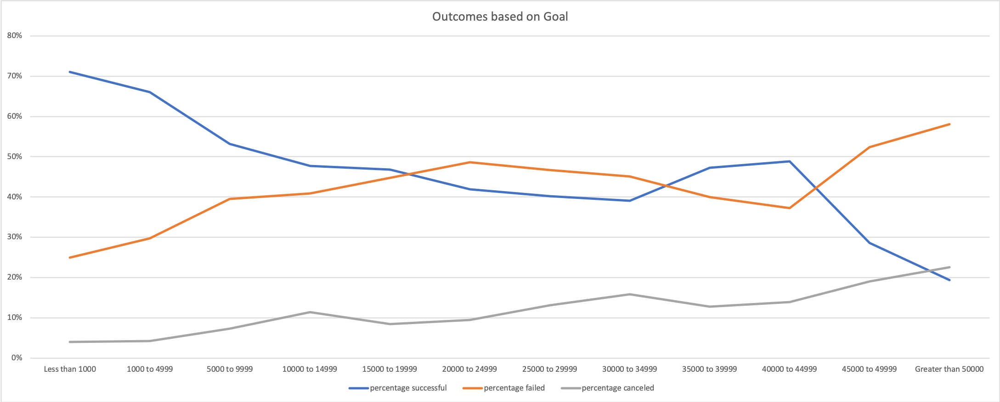
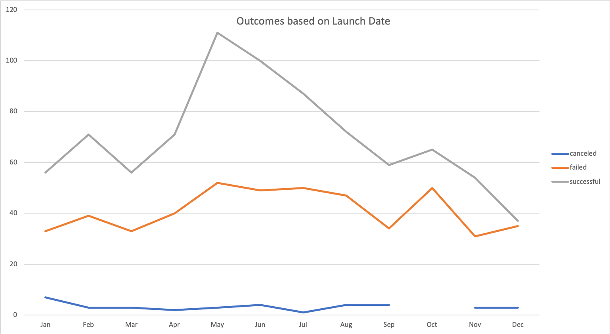

# An Analysis of Kickstarter Campaigns
## This study establishes whether outcomes of crowdfunded campaigns are impacted by factors such as goal amounts and dates, or whether some crowdfunding campaigns are limited in their scope to be successful from the start.
* An analysis of subcategory statistics shows us that crowdfunding campaigns are most successful for plays, and tend to be successful for photobook and rock campaigns. Campaigns tend to be unsuccessful or canceled altogether for videogame, animation, children's books and translation related efforts. For Louise's needs, our data helps us establish that seeking funding for her play is likely to encounter some success. 

* When assessing more statistical aspects of the data, we can see that successful campaigns for kickstarters in the US have a roughly $5,000 goal on average, while most kickstarters that are successful in the US tend to have a goal around $3,000. However, this is not to say that a $5,000 goal means success. Failed US kickstarters have, on average, a goal of $5,000. This may be due to a variety of reasons: people may not feel that a project needs what it has asked for in order to be successful, or they feel that maybe they are drawn to other kickstarter projects.
### Challenge
* To further our analysis in establishing how successful fundraising for theater campaigns can be, we can take a look at goal amounts. Since Louise is estimating a budget of $10,000, a closer look at how campaign outcomes are impacted by goal amounts is necessary. At a glance, we can establish that 48% of all Kickstarter campaigns for plays with goal amounts between $10,000 and $14,000 are successful, while 41% fail, and 11% end up being canceled. The trend in this data shows that as goal amounts increase, the percentage of success for the play kickstarter campaign decreases. We see some increase in this percentage of successful outcomes between goal amounts of $30,000 and $45,000, however this could be due to a smaller number of donors making larger contributions to a play's kickstarter.

* Launch dates for a kickstarter campaign can also impact whether or not it is successful. Outcomes for plays that have kickstarter campaigns launched in May are the most successful, while those launched between October and December tend to fail.

* To gain more insight into how kickstarter campaigns are impacted, we could further dissect data to show which countries tend to have the most successful campaigns. This insight could help us establish whether there are countries that make better environments to crowdfund.
* Based on these findings, while Louise's play Fever met its goal fairly quickly, we can see that 839 theater campaigns were successful, and that the best time to launch a campaign is in May. If others were to launch a theater project fundraising campaign in May with a goal between $1,000 and $10,000, they may be well-positioned for a successful outcome.
